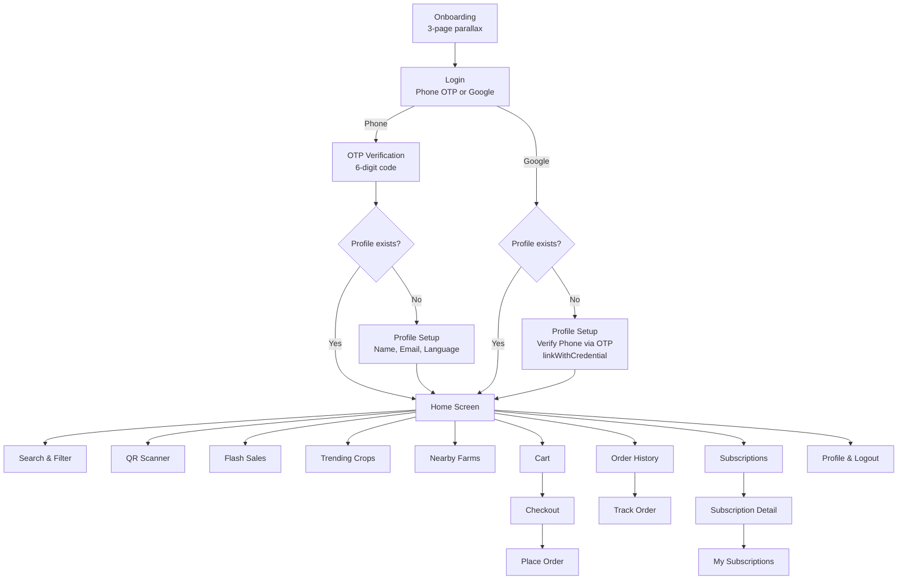

# SmartKrishi Consumer App — Product Documentation

> **Farm-to-Table Marketplace** · Flutter · Material 3 · Hackathon-Ready MVP

SmartKrishi is a **consumer-facing mobile marketplace** that connects buyers directly with local farmers. It lets consumers browse, search, and order fresh produce — including vegetables, fruits, grains, dairy, spices, and exotic items — while providing **full transparency** into the food supply chain through QR-code–based product verification and sustainability metrics.

---

## Table of Contents

1. [App Overview](#app-overview)
2. [Tech Stack](#tech-stack)
3. [Project Structure](#project-structure)
4. [User Flow](#user-flow)
5. [Feature Breakdown](#feature-breakdown)
6. [Data Models](#data-models)
7. [Screens Reference](#screens-reference)
8. [Navigation & Routing](#navigation--routing)
9. [Design System](#design-system)
10. [Assets Strategy](#assets-strategy)
11. [Current Limitations & Scope](#current-limitations--scope)
12. [Getting Started](#getting-started)

---

## App Overview

| Attribute          | Value                                         |
| ------------------ | --------------------------------------------- |
| **App Name**       | SmartKrishi                                   |
| **Package Name**   | `com.satyam.smartkrishi.consumer`              |
| **Version**        | 1.0.0+1                                       |
| **Min Dart SDK**   | ^3.10.0                                       |
| **Target Users**   | Urban/peri-urban consumers buying farm produce |
| **Tagline**        | *Fresh from Farm to Table*                     |
| **Primary Color**  | `#1B8A6E` (Teal Green)                         |

### Key Value Propositions

- **Direct Farm-to-Consumer** — Eliminate middlemen, get farm-direct pricing with savings banners.
- **Transparency & Trust** — QR-code scanning to verify product authenticity, view farm journey (Harvested → Packed → Shipped → Verified), and sustainability impact (water saved, carbon footprint).
- **Subscription Model** — Weekly/monthly curated boxes (veggies, fruits, grains, dairy, spices, herbs) with recurring delivery.
- **Smart Search & Filters** — Search by name, filter by price range, rating, organic certification, and category.
- **Order Tracking** — 5-step farm-to-doorstep tracking timeline with live distance updates.

---

## Tech Stack

| Layer              | Technology                             |
| ------------------ | -------------------------------------- |
| **Framework**      | Flutter (cross-platform)               |
| **Language**       | Dart 3.10+                             |
| **Design**         | Material 3 (`useMaterial3: true`)      |
| **State Mgmt**     | `setState` (local state only)          |
| **Auth**           | Firebase Auth (Phone OTP + Google)     |
| **Database**       | Firebase Realtime Database             |
| **Google Sign-In** | `google_sign_in: ^7.2.0`              |
| **QR Scanning**    | `mobile_scanner: ^7.2.0`              |
| **Image Picker**   | `image_picker: ^1.0.7`                |
| **SVG Support**    | `flutter_svg: ^2.0.0`                 |
| **Icons**          | Cupertino Icons + Material Icons       |
| **Data**           | Product/order data hardcoded; user profiles in Firebase RTDB |

---

## Project Structure

```
lib/
├── main.dart                        # App entry, Firebase init, AuthGate, routes
├── config/
│   └── app_assets.dart              # Centralized asset path constants
├── models/
│   ├── product_model.dart           # Product, ProductCategory, Farm, FlashSale,
│   │                                  SearchFilters, TrendingCrop models
│   ├── user_model.dart              # UserModel (uid, name, phone, email, role)
│   └── sample_data_provider.dart    # Hardcoded sample data for all screens
├── services/
│   ├── auth_service.dart            # Phone OTP + Google Sign-In + provider linking
│   └── user_service.dart            # Firebase RTDB read/write for /userProfiles
├── utils/
│   └── placeholder_generator.dart   # Fallback widgets for missing assets
│                                      + OptimizedImage widget
└── screens/
    ├── login_screen/                # Onboarding, Login, OTP (login+linking), Profile Setup
    ├── home_screen/                 # Home page + widget components
    │   └── widgets/                 # SearchBar, ProductCard, FlashSaleCard,
    │                                  FarmCard, TrendingCropCard
    ├── search_screen/               # Search results + Filter screen
    ├── cart/                        # Smart Cart with farm-grouped items
    ├── checkout/                    # Address, time slot, payment selection
    ├── orders/                      # Order history + Track order
    ├── profile/                     # User profile, stats, settings, logout
    ├── scanner/                     # QR scanner + Verified page
    └── subscriptions/               # Browse plans, detail, my subs, manage
```

---

## User Flow



---

## Feature Breakdown

### 1. Onboarding (3 slides)
- Full-screen parallax images with glassmorphism text card overlay
- Animated page dots with smooth transitions
- Language toggle (EN / हिंदी) on first slide
- Skip / Next / Get Started buttons

### 2. Authentication (Firebase Auth + Provider Linking)
- **Phone OTP Login** — Firebase `verifyPhoneNumber()`, auto-verification on Android, 30s resend cooldown
- **Google Sign-In** — Firebase `signInWithCredential()` via `google_sign_in: ^7.2.0` (singleton API)
- **Provider Linking** — Google users verify phone via OTP → `linkWithCredential()` ensures **one UID per user**
- **Duplicate Prevention** — `credential-already-in-use` caught → signs into existing account
- **OTP Verification** — 6-digit auto-advancing input fields, supports login mode + linking mode
- **Profile Setup** — Name, email (required for OTP users), phone (verified for Google users), language preference
- **AuthGate** — `main.dart` checks `FirebaseAuth.instance.currentUser` → auto-routes to Home or Onboarding
- **Logout** — Signs out from both Firebase Auth + Google, routes to `/login`
- **Dark Mode toggle** — Toggle present on login screen

### 3. Home Screen
- **Location display** — Shows "Delivery to: Delhi NCR, India"
- **Scan Now** quick-action button → opens QR scanner
- **Search Bar** — Tappable, navigates to dedicated search screen
- **Flash Sales** — Horizontal carousel with countdown timer, original/sale price, discount badge
- **Seasonal Picks** — 2-column grid of product cards with rating, freshness %, organic badge
- **Trending This Week** — Horizontal cards showing demand change (+/- %)
- **Nearby Farms** — Horizontal farm cards with rating, certification, distance
- **Bottom Navigation Bar** — Home / Subscriptions / Cart / Orders / Profile

### 4. Search & Filters
- **Real-time search** by product name or farm name
- **Grid / List view toggle**
- **Active filter chips** with "Clear All"
- **Filter Screen** with:
  - Price range slider (₹100 – ₹5000)
  - Minimum rating slider (0 – 5★)
  - Organic-only toggle
  - Category multi-select (8 categories)
  - Reset / Apply actions

### 5. QR Code Scanner
- Live camera-based QR scanning with `mobile_scanner`
- **Gallery upload** — Pick image of QR from gallery
- **Manual entry** — Type code manually
- **Hardcoded QR database** with 2 entries (`SMART_MANGO_123`, `SMART_TOMATO_456`)
- **Verified Page** on success:
  - Authenticity badge
  - Product card with harvest-to-verify timeline
  - Sustainability impact card (water saved, carbon footprint)
  - "View Farm Profile" action
- **Error bottom sheet** on invalid QR

### 6. Cart
- Items **grouped by farm** with farm name headers
- Per-item: image, name, price/unit, quantity selector (+/-), remove button
- **Suggested products** horizontal scroll from the same farm
- **Order Summary**: subtotal, delivery fee (₹2.50), farm service fee (₹1.00), total
- **Savings banner** — "You're saving ₹X with farm-direct pricing!"
- **Proceed to Checkout** button

### 7. Checkout
- **Delivery Address** — Selectable with "Change" option
- **Delivery Time Slots** — Morning (6-11 AM), Evening (4-9 PM), Anytime (8 AM-8 PM)
- **Payment Methods** — UPI (GPay/PhonePe), Cash on Delivery, SmartKrishi Wallet (with balance)
- **Order Summary** breakdown
- **Place Order** button with confirmation snackbar

### 8. Order History
- **Tab filtering**: All Orders / In Transit / Delivered / Cancelled
- Per-order card: image, product name, farm, date, price, order number, status badge
- **Action buttons by status**:
  - Delivered → View Details + Reorder
  - In Transit → Track Order + View Details
  - Cancelled → View Details + Reorder

### 9. Order Tracking
- Order ID and estimated arrival time header
- **Map placeholder** with live distance ("4.2 km away")
- **5-step delivery timeline**: Harvested → Packed → In Transit → Out for Delivery → Delivered
- Each step shows time, description, and current status indicator
- **Contact Support** button

### 10. Subscriptions
- **6 subscription plans**: Weekly Veggie Box, Monthly Grain Stash, Seasonal Fruit Box, Organic Dairy Bundle, Premium Spice Kit, Herbs & Leafy Greens
- **Frequency filter tabs**: All Plans / Weekly / Monthly
- **Popular badge** on certain plans
- Each card shows: image, title, frequency, price/delivery, schedule, items included
- **Detail Page** with full plan breakdown
- **My Subscriptions** page to manage active subscriptions
- **Manage Subscription** page for modifying/cancelling

### 11. Profile
- **Profile header**: Avatar with edit button, name, location, "GOLD MEMBER" badge
- **Impact stats card**: CO₂ Saved (12.5 kg, ~5% vs last month), Farmers Supported (48, ~12% growth)
- **Activity & Account**: Order History, Favorite Farmers, Saved Addresses, Subscriptions (2 ACTIVE), Detailed Impact Stats
- **App Settings**: Language toggle (EN/HI), Dark Mode switch
- **Logout** with confirmation dialog

---

## Data Models

| Model              | Key Fields                                                                                | Purpose                                    |
| ------------------ | ----------------------------------------------------------------------------------------- | ------------------------------------------ |
| `Product`          | id, name, farmName, price, unit, rating, reviewCount, freshness, organic, discount        | Main product entity displayed everywhere   |
| `ProductCategory`  | id, name, description, iconAsset, backgroundColor, productCount                           | Category grid items on home/search         |
| `Farm`             | id, name, farmerName, rating, distance, certification, specialties                        | Nearby farms section                       |
| `FlashSale`        | id, title, originalPrice, salePrice, discountPercent, endsAt, farmName                    | Flash sale carousel with countdown timer   |
| `TrendingCrop`     | id, name, demandChange, averagePrice, farmCount                                           | Trending section showing demand % change   |
| `SearchFilters`    | minPrice, maxPrice, maxDistance, onlyOrganic, harvestDate, minRating, selectedCategories   | Passed between search and filter screens   |
| `UserModel`        | uid, name, phone, email, role, language, createdAt                                        | Firebase RTDB user profile (`/userProfiles/{uid}`) |

**Additional local models** (defined within screen files):
- `CartItem` — Cart page items with quantity tracking
- `SuggestedProduct` — Suggested items in cart
- `Order` — Order history items with status
- `TrackingStep` — Order tracking timeline steps
- `DeliveryAddress`, `DeliveryTimeSlot`, `PaymentMethod` — Checkout selections
- `SubscriptionPlan`, `SubscriptionItem`, `UserSubscription` — Subscription system

---

## Navigation & Routing

| Route               | Screen                | Access From                          |
| -------------------- | --------------------- | ------------------------------------ |
| `/` (home)           | `AuthGate`            | App launch → routes to Home or Onboarding |
| `/home`              | `HomeScreenPage`      | After profile setup / nav bar        |
| `/login`             | `LoginScreen`         | From logout, or AuthGate             |
| `/subscriptions`     | `SubscriptionsPage`   | Bottom nav bar                       |
| `/cart`              | `CartPage`            | Bottom nav bar                       |
| `/checkout`          | `CheckoutPage`        | Cart → Proceed to Checkout           |
| `/profile`           | `ProfilePage`         | Bottom nav bar                       |
| `/orders`            | `OrderHistoryPage`    | Bottom nav bar                       |

**Push-navigated (non-named) routes:**
- `ScannerPage` — From home "Scan Now" button
- `VerifiedPage` — After successful QR scan
- `SearchScreenPage` — From home search bar tap
- `FilterScreen` — From search filter button
- `TrackOrderPage` — From order history "Track Order"
- `SubscriptionDetailPage` — From subscription card tap
- `MySubscriptionsPage` — From subscriptions "My Subs" button

---

## Design System

| Token             | Value                                        |
| ----------------- | -------------------------------------------- |
| **Primary**       | `#1B8A6E` (Teal Green)                       |
| **Seed Color**    | `Color(0xFF1B8A6E)` via `ColorScheme.fromSeed` |
| **Material**      | Material 3 (`useMaterial3: true`)            |
| **Border Radius** | 8px (cards), 12px (inputs, buttons), 14-20px (premium CTA) |
| **Shadows**       | `0.05 opacity, 4px blur, Offset(0,2)` — consistent card elevation |
| **Typography**    | System defaults, bold headers (18-28px), body (12-16px) |
| **Status Colors** | Green = delivered/success, Amber = in-transit, Red = cancelled/error |

**UI Patterns:**
- Glassmorphism (`BackdropFilter`) on onboarding
- Parallax scrolling effect on onboarding images
- Animated page indicators (expanding/contracting dots)
- Consistent `AppBar` with white background, no elevation
- Farm-grouped cart items
- Timeline stepper for order tracking

---

## Assets Strategy

All asset paths are centralized in `lib/config/app_assets.dart`. Assets include:

- **Onboarding images** (`onboarding1-3.jpg`)
- **Product images** (mangoes, tomatoes, potatoes, etc. — PNG format)
- **Category icons** (8 SVG icons for product categories)
- **UI icons** (filter, location, farm — SVG)
- **Auth assets** (Google logo, profile placeholder)

The `PlaceholderGenerator` utility provides fallback widgets when images are missing, and `OptimizedImage` wraps `Image.asset` with graceful error handling.

---

## Current Limitations & Scope

> [!IMPORTANT]
> This is a **hackathon/demo MVP**. Product/order data is hardcoded. User authentication and profiles are powered by Firebase.

| Area                | Status                                                        |
| ------------------- | ------------------------------------------------------------- |
| Backend/API         | ❌ Product data from `SampleDataProvider` (hardcoded)           |
| Authentication      | ✅ Firebase Auth — real Phone OTP + Google Sign-In              |
| Provider Linking    | ✅ `linkWithCredential()` — one UID per user                    |
| User Profiles       | ✅ Firebase Realtime Database (`/userProfiles/{uid}`)           |
| Payment Processing  | ❌ Simulated — snackbar confirmation only                       |
| Order Persistence   | ❌ No persistence — data resets on app restart                   |
| Cart State          | ❌ Local only — hardcoded initial items, not shared across screens |
| Dark Mode           | ❌ Toggle exists but no theme switching implemented              |
| Language Switching  | ❌ UI elements present but no i18n/l10n                          |
| Image Picker        | ✅ Plugin installed, gallery QR scan works                       |
| QR Scanner          | ✅ Functional with `mobile_scanner` + hardcoded 2-item database  |
| Push Notifications  | ❌ Not implemented                                               |
| Maps Integration    | ❌ Placeholder only (no Google Maps)                             |

---

## Getting Started

### Prerequisites
- Flutter SDK (Dart 3.10+)
- Android Studio / Xcode (for device emulation)
- Firebase project with Phone Auth + Google Sign-In enabled
- `google-services.json` in `android/app/`
- SHA-1 & SHA-256 fingerprints registered in Firebase Console

### Run the App

```bash
# Clone and navigate
cd smartkrishi_consumer_app

# Install dependencies
flutter pub get

# Run on connected device or emulator
flutter run
```

### Generate App Icons

```bash
flutter pub run flutter_launcher_icons
```

### Build APK

```bash
flutter build apk --release
```

---

*SmartKrishi Consumer App v1.0.0 — Built for 6th Semester Hackathon Presentation*
